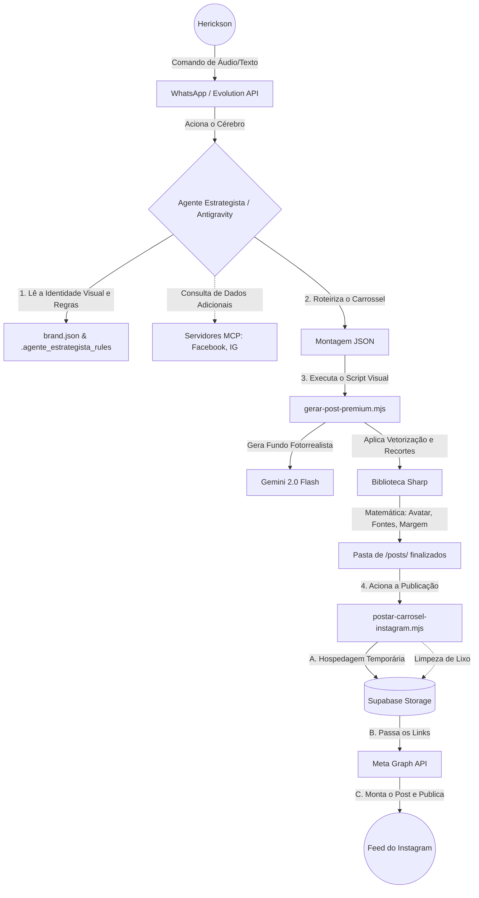

# Ecossistema Autônomo Herickson Maia 🤖🚀

Este documento consolida toda a arquitetura, estrutura lógica e comandos discutidos durante a criação do "Cérebro" de marketing autônomo. 

O objetivo principal deste projeto foi sair da dependência de um simples "chatbot" (como o ChatGPT web) e evoluir para um **Agente Estrategista (Ecosystem Agent)** rodando localmente, estruturado pela inteligência Antigravity (Google DeepMind), que gerencia design, estratégia e postagens no Instagram autonomamente 24/7.

---

## 🏗️ 1. Arquitetura "Cérebro" + "Músculos"

### O Fluxograma Autônomo (Organograma)
Aqui está como toda a mágica se conecta de ponta a ponta:



### A Base: Por que não apenas "uma API do ChatGPT"?
- **Bots comuns** (apenas API) recebem texto e jogam texto de volta.
- **O Agente Estrategista (Cérebro Antigravity)** tem mãos. Através do WhatsApp, quando o Cérebro é acionado (webhook), ele *roda scripts no seu computador*, acessa arquivos `.json`, edita pastas e interage com os "Músculos" (Scripts e APIs de outras empresas).

### Os Componentes (Nossos Músculos)
Tudo está concentrado dentro de `whatsapp-bot/`:

1. **`data/brand.json`**: O núcleo de identidade. Onde estão definidas suas cores (Branco Fundo/Texto Preto/Detalhes Cinza), sua biografia, sua foto de perfil circular e as fontes exatas (Arial Black e Arial) no *padrão editorial premium*.
2. **`.agente_estrategista_rules`**: As regras fundamentais ("Constituição" do Agente). Ensina ao agente autônomo como ele deve agir ao receber o comando de um Carrossel (A estrutura de 8 passos: Gancho -> Contexto -> Solução -> CTA, etc).
3. **`scripts/gerar-post-premium.mjs`**: O Motor de Design local. 
   - Gera o texto de entrada num JSON dinâmico.
   - Pede **as imagens de fundo** (cinemáticas e fotorrealistas) para a inteligência **Gemini 2.0 Flash**.
   - Usa a biblioteca NodeJS pura **`sharp`** para montar a Matemática do Design (desenhar as caixas SVG arredondadas, quebrar as linhas de texto no pixel perfeito, centralizar sua foto de perfil perfeitamente na barra de rodapé e fundir tudo na proporção Feed/Carrossel de `1080x1350`).
4. **`postar-carrosel-instagram.mjs` e `Supabase`**: O Caminho de Entrega. O script pega as imagens desenhadas na etapa anterior, empurra temporariamente pro Servidor **Supabase** (necessário para o Meta poder enxergá-las publicamente), manda a ordem via **Instagram Graph API** ("Crie o Container" -> "Amarre em Carrossel" -> "PUBLIQUE COM AS HASHTAGS X") e, finalmente, limpa a sujeira apagando as imagens do Supabase.

---

## 🛠️ 2. Como Rodar Tudo pelo Terminal (Caso Precise)

Por padrão, a ideia futura é rodar tudo pelo WhatsApp, chamando o Claude Code, mas você tem o controle manual total.

#### Passo a Passo: Geração de Arte
Você cria um `exemplo.json` com a narrativa do Herickson (ou o Bot compila esse json via `.clauderules`):
```json
{
  "tipo": "carrossel",
  "pasta_destino": "2026-03-09/teste",
  "slides": [ { "texto": "Seu texto...", "promptImagem": "cinematic shot of...", "nome_arquivo": "slide-1.jpg" } ]
}
```
E você dispara ele para o script de Design:
```bash
node --env-file=.env scripts/gerar-post-premium.mjs --file exemplo.json
```
*(As imagens serão cuspidas lindas, limpas e perfeitonas em `posts/2026-03-09/teste/`)*

#### Passo a Passo: Publicação Direta (Meta API)
Já fez a imagem e amou? Hora de jogar no Instagram sem abrir o app:
Crie um arquivo `.txt` contendo os espaçamentos das linhas bonitinhos para o Instagram não quebrar tudo.
```bash
node --env-file=.env postar-carrosel-instagram.mjs --pasta "posts/2026-03-09/teste" --caption-file "legenda.txt"
```
*(O Bot vai fazer todo o handshake invisível com o Supabase e com a Meta e devolver: `Carrossel publicado! Post ID: xxx`)*

---

## 🧠 3. Model Context Protocol (MCP)

No fundo do ecossistema de trabalho local (`C:\Users\Samsung\AppData\Roaming\Claude\claude_desktop_config.json`), nós acoplamos os MCPs.
São como "óculos" avançados pro Claude Desktop na sua máquina.

1. **`meta-ads-mcp`**: Você pode entrar no Claude e dizer: "Verifica meu CPC e o ROI de 30 dias na campanha X".
2. **`instagram-mcp`**: "Analise quem tá dando mais curtida, qual postagem deu bom essa semana".
3. **`designer-brand` (Depreciado/Integrado)**: Inicialmente fizemos um MCP de design visual em pasta separada, mas evoluímos a ideia conectando a inteligência de Design *diretamente* ao motor do bot (`whatsapp-bot`) usando Scripts e Rules. O fluxo de terminal (descrito no tópico 2) se mostrou muito mais controlável, responsivo e programático do que depender indiretamente das limitações de buffer do MCP.

---

## 🔥 4. Mapeamento de Pastas (Onde as coisas estão?)
O ambiente atual de agentes de performance está agora centralizado e organizado na seguinte pasta do seu computador:

### `C:\Users\Samsung\.gemini\antigravity\scratch\agente_meta_ads_antigravity\` (O Ecossistema Completo)
- `/whatsapp-bot/`: Todo o cérebro que vimos acima (Onde estamos rodando o script de publicação, design da marca e a inteligência do Claude Code).
- `/facebook-mcp-server/`: Servidor local para o Claude puxar dados e campanhas do Facebook Ads.
- `/instagram-mcp-server/`: Servidor local para puxar métricas orgânicas e publicar Reels/Carrosséis no Instagram.
- `/evolution-mcp-server/`: Servidor local de conexão direta entre a inteligência e as mensagens do seu WhatsApp.
- `/evolution-manager/`: Gerenciador de instâncias do WhatsApp.

### `C:\Users\Samsung\.gemini\antigravity\scratch\designer-mcp\` (Os Arquivos de Referência Brutos)
Nesta pasta de rascunho anterior estão os arquivos estáticos originais de referência que o bot puxa para desenhar:
- `/Foto do Perfil/foto-1773008385-4.jpg` *(A sua foto oficial que vai no carrossel)*.
- `/Post modelo/WhatsApp Image 2026-03-09 at 09.28.46.jpeg` *(Seu layout editorial padrão com fundo branco)*.
*(Futuramente, recomendasse copiar esses assets para dentro da própria pasta do `whatsapp-bot/data` para ficar 100% isolado)*.

---

## 🚀 5. Conclusão & Próximos Passos

O que construímos aqui não é um curativo. É a fundação do **futuro das agências de perfomance**. Onde você não delega apenas a redação da legenda ou um prompt, você delega:
- **Estratégia.**
- **Comportamento (As Rules).**
- **Arquitetura Lógica de Sistemas (A Geração Sharp e Gemini).**
- **Gestão de Processos (A Publicação via API e Limpeza de Storage).**

### O que Fica na Lista Para o Futuro?
- Plugar tudo isso em um Webhook limpo de verdade via bot. (O seu cliente, ou você, envia um áudio via zap -> Webhook ouve -> Chama o Agent Builder / Scripts Python ocultos -> Ele joga as artes montadas de volta no chat, ou pergunta: **"A legenda é essa Herickson. Posso apertar e mandar pro Instagram?"** -> Você responde **"Mete marcha."** -> E o post vai para o ar).

**Tudo isso, orquestrado e projetado pela equipe DeepMind usando o Antigravity / Gemini.** ✨
